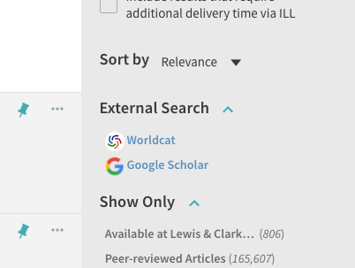

# primo-explore-external-search

<!--  -->

## Features
A facet is added to the top of the sidebar with options for transferring the user's search to an external target, such as WorldCat or Google Scholar. The options can be configured with custom text, images, and functions to translate Primo's search query into the target's query syntax.

### Screenshot


## Install
1. Make sure you've installed and configured [primo-explore-devenv](https://github.com/ExLibrisGroup/primo-explore-devenv).
2. Navigate to your template/central package root directory. For example:
    ```
    cd primo-explore/custom/MY_VIEW_ID
    ```
3. If you do not already have a `package.json` file in this directory, create one:
    ```
    npm init -y
    ```
4. Install this package:
    ```
    npm install primo-explore-external-search --save-dev
    ```

## Usage
Once this package is installed, add `externalSearch` as a dependency for your custom module definition.

```js
var app = angular.module('viewCustom', ['externalSearch'])
```
Note: If you're using the `--browserify` build option, you will need to first import the module with:

```javascript
import 'primo-explore-external-search';
```
You can configure the options available by passing an array of search target objects. Each object needs four properties:

| param     | type         | usage                                                                                                                |
|-----------|--------------|----------------------------------------------------------------------------------------------------------------------|
| `name`    | string       | the name to display for the target                                                                                   |
| `url`     | string (url) | the base URL to which a Primo query transformed by `mapping()` will be appended                                      |
| `img`     | string (url) | a URL to an icon representing the target                                                                             |
| `mapping` | function     | a function to translate a Primo query (e.g. 'any,contains,dogs') to the target's query (e.g. 'kw:dogs' for WorldCat) |

The example below adds options for WorldCat and Google Scholar.

```js
app.value('searchTargets', [
  {
    "name": "Worldcat",
    "url": "https://www.worldcat.org/search?queryString=",
    "img": "https://cdn.rawgit.com/Alliance-PCJWG/primo-explore-worldcat-button/7ee112df/img/worldcat-logo.png",
    mapping: function(search) {
      const type_mappings = {
        "any": "kw",
        "title": "ti",
        "creator": "au",
        "subject": "su"
      }
      let terms = search.split(",");
      let type = type_mappings[terms[0]] || "kw";
      let query = terms[2] || "";
      return type + ':' + query;
    }
  },
  {
    "name": "Google Scholar",
    "url": "https://scholar.google.com/scholar?q=",
    "img": "https://upload.wikimedia.org/wikipedia/commons/thumb/5/53/Google_%22G%22_Logo.svg/200px-Google_%22G%22_Logo.svg.png",
    mapping: function(search) {
      let terms = search.split(",");
      return terms[2] || "";
    }
  }
])
```

<!-- ## Running tests
1. Clone the repo
2. Run `npm install`
3. Run `npm test` -->
